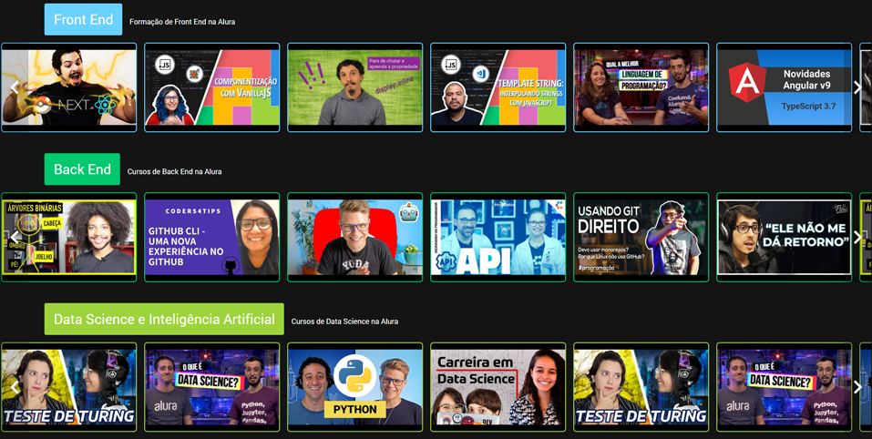
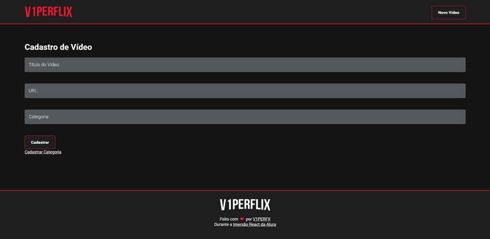
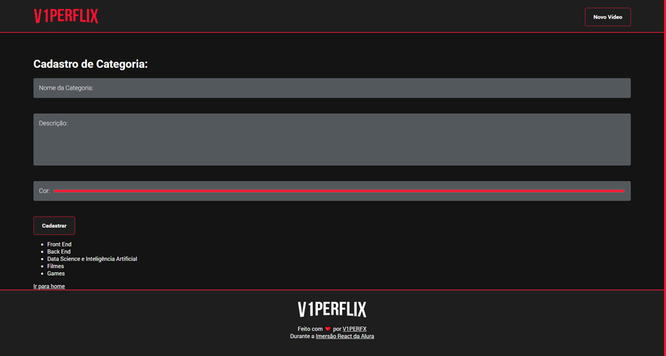

<h1 align="center">
  
  <br>
</h1>

<p align="center">
  
  
  
  
  
  
  
  
  
</p>

<h4 align="center">
  <p>Aplicação reúne um compilado de vídeos do YouTube separadas por categorias, funcionando como um repósitorio para salvar vídeos que você gosta, assim podendo ser encontrado facilmente num layout que remete ao da Netflix.</p>
  <p>Projeto feito durante a Imersão React da <a href="https://www.alura.com.br/">Alura</a>.</p>
</h4>


<p align="center">
  |&nbsp;&nbsp;&nbsp;
  <a href="#tecnologias">Tecnologias</a>&nbsp;&nbsp;&nbsp;|&nbsp;&nbsp;&nbsp;
  <a href="#como-usar">Como usar</a>
  &nbsp;&nbsp;&nbsp;|
</p>

## Screenshots

<p align="center">
  
  
  
  
</p>

## Tecnologias

Projeto desenvolvido com as seguintes tecnologias:

- [HTML][html]
- [CSS][css]
- [React][react]

## Como usar

No terminal:

```bash
# Faça um clone deste repositório
$ git clone https://github.com/V1PERFX/v1perflix.git

# Entre no repositório
$ cd v1perflix

# Instale as dependências
$ npm install

# Execute
$ npm run dev
```

---
<h4 align="center">
  Feito com :heart: por <a href="https://www.linkedin.com/in/v1perfx/">V1PERFX</a> 
</h4>

[html]: https://developer.mozilla.org/pt-BR/docs/Web/HTML
[css]: https://developer.mozilla.org/pt-BR/docs/Web/CSS
[react]: https://pt-br.reactjs.org/docs/getting-started.html